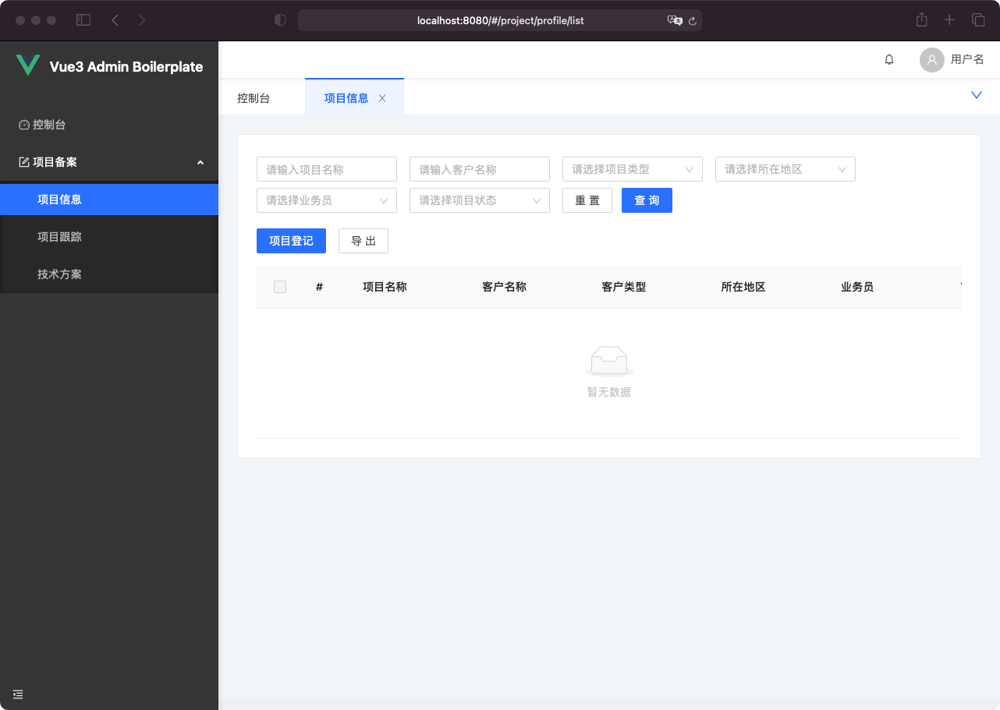

# homedo-vue3-boilerplate

基于 Vue3 + Ant Design 的中后台系统模板仓库, 用于加快前端的研发速度, 由河姆渡浦东研发中心开发和维护



## 如何使用

```bash
https://github.com/rmlzy/homedo-vue3-boilerplate.git
cd homedo-vue3-boilerplate
npm run install
npm run dev
```

## 目录结构说明
```bash
├── public                             # 公开资源
├── src                                # 源码目录
│   ├── assets                         # 静态资源
│   ├── components                     # 公共组件
│   ├── core                           # 核心配置
│   ├── layout                         # 布局文件
│   ├── store                          # Vuex
│   ├── types                          # TS 类型定义
│   ├── utils                          # 公共函数
│   └── views                          # 页面文件
│       ├── dashboard                  # 控制台模块
│       │    └── dashboard-routing.ts  # 控制台模块路由
│       ├── login                      # 登录模块
│       │    ├── components            # 登录模块子组件
│       │    ├── index.vue             # 登录模块入口
│       │    ├── login.component.html  # 登录页面模板
│       │    ├── login.component.less  # 登录页面样式
│       │    ├── login.component.ts    # 登录页面逻辑
│       │    ├── login.component.const # 登录页面常量
│       │    ├── login.interface.ts    # 登录页面接口定义
│       │    └── login.routing.ts      # 登录模块路由
│       ├── app.routing.ts             # 路由入口
│       ├── app.vue                    # Vue 根组件
│       └── main.ts                    # 应用入口
├── .env.dev                           # DEV 环境配置
├── .env.fat                           # FAT 环境配置
├── .env.uat                           # UAT 环境配置
├── .env.pro                           # 线上环境配置
├── .gitignore                         # Git 忽略文件
├── .npmrc                             # NPM 配置, 指定了私服地址
├── .prettierrc                        # Prettier 配置文件
├── babel.config.js                    # Babel 配置
├── package.json
├── package-lock.json
├── tsconfig.json                      # TS 配置
└── vue.config.js                      # 打包配置
```

在组件定义这块, 借鉴了 Angular 的思想, 把单文件组件拆分成了:
+ `demo.component.html`: 对应单文件组件里的 `<template></template>`
+ `demo.component.ts`: 对应单文件里的 `<script lang="ts"></script>`
+ `demo.component.less`: 对应单文件里的 `<style lang="less"><style>`

另外还需要一个入口, 把这三份文件串联起来, 入口文件的代码很简单:

```vue
<template src="./demo.component.html"></template>

<script lang="ts">
export { default } from "demo.component.ts";
</script>

<style lang="less" scoped>
@import "demo.component.less";
</style>
```

## NPM 脚本说明
根据环境的不同, npm scripts 分为七个:

1. `npm run dev`: 启动开发服务, 连接到 Java 服务的 DEV 环境, 读取 `.env.dev` 配置
2. `npm run dev:fat`: 启动开发服务, 连接到 Java 服务的 FAT 环境, 读取 `.env.fat` 配置
3. `npm run dev:uat`: 启动开发服务, 连接到 Java 服务的 UAT 环境, 读取 `.env.uat` 配置
4. `npm run build:dev`: 打包为 DEV 环境, 读取 `.env.dev` 配置
5. `npm run build:fat`: 打包为 FAT 环境, 读取 `.env.fat` 配置
6. `npm run build:uat`: 打包为 UAT 环境, 读取 `.env.uat` 配置
7. `npm run build:pro`: 打包为线上环境, 读取 `.env.pro` 配置

CD 发布系统会读取 `npm run build:*` 这四个部署命令, 请勿随意更改

## 加速三件套
+ [homedo-vue3-boilerplate](https://github.com/rmlzy/homedo-vue3-boilerplate): 一个模板仓库
+ [homedo-cli](https://github.com/rmlzy/homedo-cli): 一个生成代码的终端命令
+ [homedo-utils](https://github.com/rmlzy/homedo-utils): 河姆渡常用的公共方法

如果对你有帮助, 欢迎点一下 Star

如果有问题, 可以通过 rmlzy@outlook.com 找到我

## LICENSE
MIT
